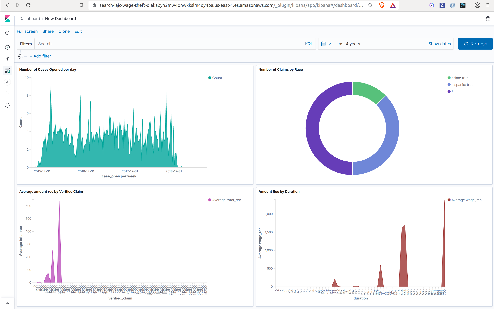

# Elastic-Kibana Setup

A Python simple python script and development environment to index LAJC data to an elastic search cluster.



See Links for:

- [kibana dashboard on AWS](https://bit.ly/2oCCaAw)
- [elastic cluster on AWS]( https://search-lajc-wage-theft-oiaka2yn2mw4onwkkslm4oy4pa.us-east-1.es.amazonaws.com)

## Setup and Run

Requirements:

- [python 2](https://www.python.org/downloads/release/python-2716/)
- [pip](https://pip.pypa.io/en/stable/installing/)
- [docker](https://docs.docker.com/install/linux/docker-ce/ubuntu/)

Steps:

```bash
# install requirements
$ cd elastic-kibana
$ pip install -r requirements.txt
..
# make sure the script compiles
$ python index_data.py --help

Indexes csv data from '../Raw data/lajc_clean.csv' into an elastic 
search cluster under the index 'claims'

USAGE: 
	python2.7 index_data.py [ELASTIC_SEARCH_ENDPOINT or --help]
# start local instances of elastic and kibana
$ docker-compose up -d
...
# index data into local elastic search endpoint
$ python index_data.py http://localhost:9200
..
indexing claim 3984 of 3948
# see that data was succesfully loaded
$ curl http://localhost:9200/claims/search | jq
...
```

## Authors

- Dan Harris [dshva](https://github.com/dshva)
- David Goldstein [dgoldstein1](https://github.com/dgoldstein1)

